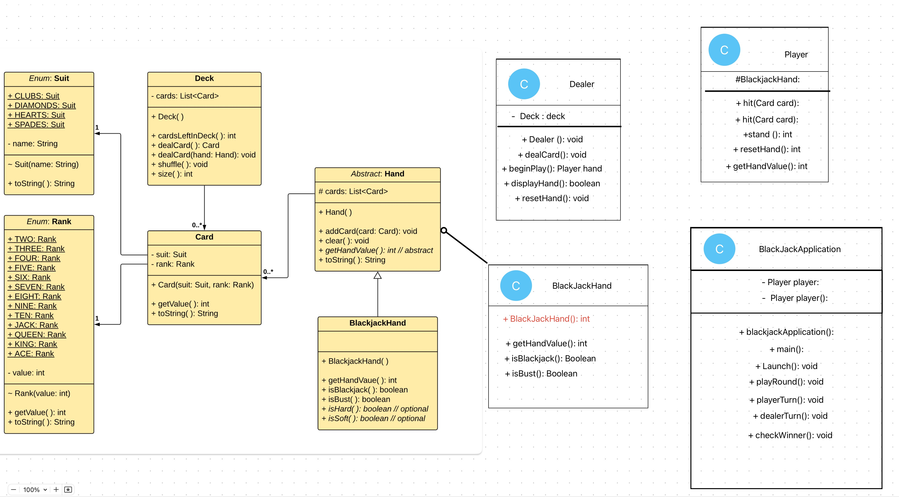

# BlackjackProject

 

## Description
make a working Blackjack game incorperating the fundamentals of OOP abstraction, encapsulation, inheritance, and polymorphism. 
Building classes in an Object-Oriented manner: APIE.
Building classes whose fields are Objects (has-a).
Writing methods.
Using collections to organize and manage data.
Using conditionals to create game logic.
Considering common data and behaviors, and refactoring into parent / child classes.
making a working Blackjack game incorperating the fundamentals of OOP abstraction, encapsulation, inheritance, and polymorphism. 

## Technologies used
 - Java
 - Eclipse
 - Git/GitHub
 - Sublime Text Editor
 - zsh
 - Sublime
 - docs.oracle.com/en/javase/8/docs/api
 - 

## UML Diagram

    

 ## Concepts Applied

    - Abstraction

    - Encapsulation
    - Inheritance
    - Polymorphism
    - Composition

## Plan

### 1. Requirements & Planning
- [x] Define project objectives and features
     - Story #1: Create class structure that models deck of cards. - done in class
     - Story #2: Create functionality of shuffling and removing cards from players hands - done in class
     - Story #3: Deal 2 hands of cards, 2 to each player. - Handled in the Dealer class. 
     - Story #4: Create logic for Blackjack with first facecard down - TBD
     - Story #5: Determine the winnner - TBD

### 2. Design & Architecture
- [ ] Create UML diagrams or flowcharts
- [ ] Define interfaces (set contracts for modules)
- [ ] Plan your class hierarchy and component interactions
        - work in progress

### 3. Set Up the Project Structure
- [ ] Create package structure  - done in class

### 4. Implement the Backbone
- [ ] Write core classes
- [ ] Build primary logic and workflows for a minimal viable version
    - work in progress

### 8. Testing & Debugging
- [ ] Run integration, system, and user acceptance tests

### Leasons Learned

    the diagrams help for finding what methods are in each class. 
    need to make a seperate image folder for the readme if you want add pics. 

## Notes

/zvz/

